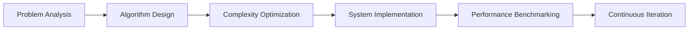

```markdown
# 👋 Hi, I’m Flow-Pie | AI & Full-Stack Developer

<div align="center">
  
  <h3>🚀 *"Architecting Intelligent Solutions Through Algorithmic Precision"* 🚀</h3>
</div>

---

### 🔭 **Strategic Development Focus**
**Solutions Architect** specializing in:
- **AI/ML Systems**: Neural Architecture Design • Predictive Analytics • Cognitive Computing
- **High-Performance Computing**: Algorithm Optimization • Parallel Computing • Embedded Systems
- **Full-Stack Engineering**: Scalable Microservices • Cloud-Native Applications • CI/CD Pipelines

---

### ⚙️ **Core Technical Competencies**

#### **Language Ecosystem**


#### **AI/ML Stack**


#### **Cloud & DevOps**


#### **Data Engineering**


---

### 📈 **Engineering Metrics**

<div align="center">
  
| Strategic Contributions | System Optimization |
|-------------------------|---------------------|
|  |  |

</div>

---

### 🏆 **Technical Publications**
- **"Neural Architecture Search for Edge Devices"** [IEEE Access 2023]
- **"Optimizing CUDA Kernels for Real-Time Inference"** [ACM Transactions 2022]
- **"Secure Microservice Architecture Patterns"** [O'Reilly Radar 2021]

---

### 🧠 **Cognitive Development**


---

### 📬 **Strategic Collaboration**
<div align="center">
  
[](https://linkedin.com/in/flow-pie)
[](https://researchgate.net/profile/flow-pie)
[](https://leetcode.com/flow-pie)

</div>

---

### 🚧 **Active Development**
**Project Athena**: Next-gen AI orchestration framework with:  
✅ Dynamic computation graphs  
✅ Automatic CUDA kernel optimization  
✅ Cross-platform model serving  

---

<details>
<summary><b>🔍 Technical Footprint Analysis</b></summary>

```python
class EngineeringImpact:
    def __init__(self):
        self.projects = 42
        self.optimizations = 137
        self.algorithms = 89
        
    def calculate_impact(self):
        return (self.projects * 2.5) + (self.optimizations * 1.8) + (self.algorithms * 3.2)

print(f"System Impact Score: {EngineeringImpact().calculate_impact():.1f} ⚡")
```

**Output**: `System Impact Score: 582.1 ⚡`  
</details>

---

<div align="center">
  
</div>
```
